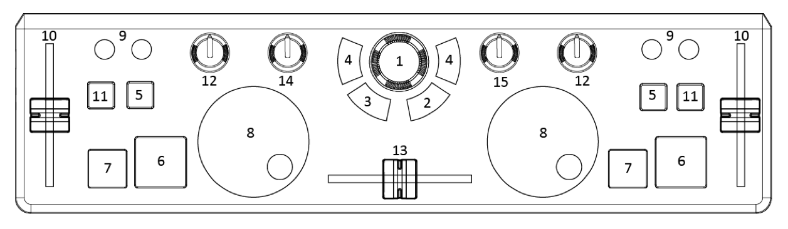

# [midify]-numark-dj2go [](http://badge.fury.io/js/midify-numark-dj2go) [](https://gemnasium.com/ben-eb/midify-numark-dj2go)

> [midify] compatible map for the Numark DJ 2 Go.

Install via [npm](https://npmjs.org/package/midify-numark-dj2go):

```
npm install midify-numark-dj2go
```

## What it does

[midify] is a package that combines node's event emitter with the browser's web midi api, to make working with midi messages more palatable. This module provides handlers for the Numark DJ 2 Go, intended to be used with midify, but also provides a reference for the various controls on the device so that it can be used with other modules too!

## Example

Bundle this code with [browserify](https://github.com/substack/node-browserify). Note that Web MIDI is currently available behind a flag in Chrome, and remains unsupported in other browsers. To enable it in Chrome, go to [chrome://flags](chrome://flags) and ensure that the Web MIDI option is on. As of this writing, MIDI support in Chrome is not quite plug and play capable, so you'll need to shut down Chrome and plug your device in before testing any code.

```js
var Midify = require('midify');
var dj2go = require('midify-numark-dj2go');

navigator.requestMIDIAccess().then(function(midiAccess) {
    var midiIn;
    var midiOut;

    // For brevity, we are just assuming one MIDI device is connected
    for (var input of midiAccess.inputs.values()) {
        midiIn = input;
    }

    for (var output of midiAccess.outputs.values()) {
        midiOut = output;
    }

    var midify = new Midify({
        midiIn: midiIn,
        midiOut: midiOut,
        controller: dj2go
    });

    midify.on('*', function(event) {
        console.log('triggered', event, 'event');
    });

}, function() { console.error('MIDI access unavailable'); });
```

## Mapping



Substitute `deckX` for `deckA` or `deckB` depending on which side of the controller the control is.

<table>
    <tr>
        <th></th>
        <th colspan="2">Input (midify.on(event, callback))</th>
        <th>Output (midify.send(event))</th>
    </tr>
    <tr>
        <td>1</td>
        <td colspan="2">browse.change</td>
        <td></td>
    </tr>
    <tr>
        <td>2</td>
        <td colspan="2">enter.on / enter.off</td>
        <td></td>
    </tr>
    <tr>
        <td>3</td>
        <td colspan="2">back.on / back.off</td>
        <td></td>
    </tr>
    <tr>
        <td>4</td>
        <td colspan="2">deckX.load.on / deckX.load.off</td>
        <td></td>
    </tr>
    <tr>
        <td>5</td>
        <td colspan="2">deckX.sync.on / deckX.sync.off</td>
        <td>deckX.sync.on / deckX.sync.off</td>
    </tr>
    <tr>
        <td>6</td>
        <td colspan="2">deckX.play.on / deckX.play.off</td>
        <td>deckX.play.on / deckX.play.off</td>
    </tr>
    <tr>
        <td>7</td>
        <td colspan="2">deckX.cue.on / deckX.cue.off</td>
        <td>deckX.cue.on / deckX.cue.off</td>
    </tr>
    <tr>
        <td>8</td>
        <td colspan="2">deckX.wheel.change</td>
        <td></td>
    </tr>
    <tr>
        <td>9</td>
        <td>deckX.pitchUp.on / deckX.pitchUp.off</td>
        <td>deckX.pitchDown.on / deckX.pitchDown.off</td>
        <td></td>
    </tr>
    <tr>
        <td>10</td>
        <td colspan="2">deckX.pitch.change</td>
        <td></td>
    </tr>
    <tr>
        <td>11</td>
        <td colspan="2">deckX.pfl.on / deckX.pfl.off</td>
        <td>deckX.pfl.on / deckX.pfl.off</td>
    </tr>
    <tr>
        <td>12</td>
        <td colspan="2">deckX.volume.change</td>
        <td></td>
    </tr>
    <tr>
        <td>13</td>
        <td colspan="2">crossfader.change</td>
        <td></td>
    </tr>
    <tr>
        <td>14</td>
        <td colspan="2">masterGain.change</td>
        <td></td>
    </tr>
    <tr>
        <td>15</td>
        <td colspan="2">headphoneGain.change</td>
        <td></td>
    </tr>
</table>

## License

MIT © [Ben Briggs](http://beneb.info)

[midify]: https://github.com/ben-eb/midify
